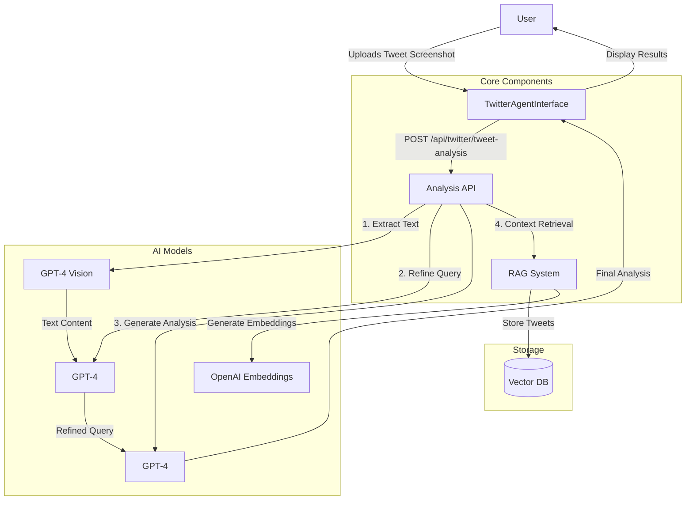

# Tweet Analysis RAG System

## System Architecture & Flow

## Flow Description

### 1. Tweet Upload Flow

1. User uploads a tweet screenshot through the interface
2. Image is sent to the analysis API endpoint
3. GPT-4 Vision extracts text from the image
4. Query is refined for focused analysis
5. System retrieves relevant context from RAG
6. Final analysis is generated and displayed

### 2. RAG Creation Flow

1. Process tweet content into chunks
2. Generate embeddings for each chunk
3. Store in vector database with metadata
4. Index for similarity search
5. Ready for context retrieval

## Technical Implementation

### Tweet Analysis Flow

\`\`\`typescript
// 1. Upload Image
const handleAnalyze = async (file: File) => {
  const formData = new FormData();
  formData.append("file", file);
  
  // 2. Send to API
  const response = await fetch("/api/twitter/tweet-analysis", {
    method: "POST",
    body: formData
  });
  
  // 3. Process Results
  const { tweetText, analysis } = await response.json();
};
\`\`\`

### RAG Creation Process

\`\`\`typescript
// 1. Process Content
const tweets = processTweetContent(content);

// 2. Generate Embeddings
for (const tweet of tweets) {
  const embedding = await generateEmbedding(tweet);
  
  // 3. Store in Database
  await db.insert(ragContent).values({
    content: tweet,
    embedding,
    metadata: { type: "tweet" }
  });
}
\`\`\`

## Key Components

### 1. UI Components

- `TwitterAgentInterface`: Main interface for tweet analysis
- File upload with drag & drop
- Real-time analysis display
- Error handling & loading states

### 2. API Endpoints

- `/api/twitter/tweet-analysis`: Process tweet screenshots
- `/api/rag/create/twitter`: Create & manage RAG system

### 3. RAG System

- Vector embeddings for semantic search
- PostgreSQL with pgvector extension
- OpenAI's text-embedding-3-large model

### 4. Analysis Pipeline

- GPT-4 Vision for text extraction
- Context-aware prompting
- Structured analysis generation

## Technologies Used

- Next.js 13 App Router
- OpenAI GPT-4 Vision
- Vector Embeddings
- PostgreSQL with pgvector
- TypeScript
- TailwindCSS
